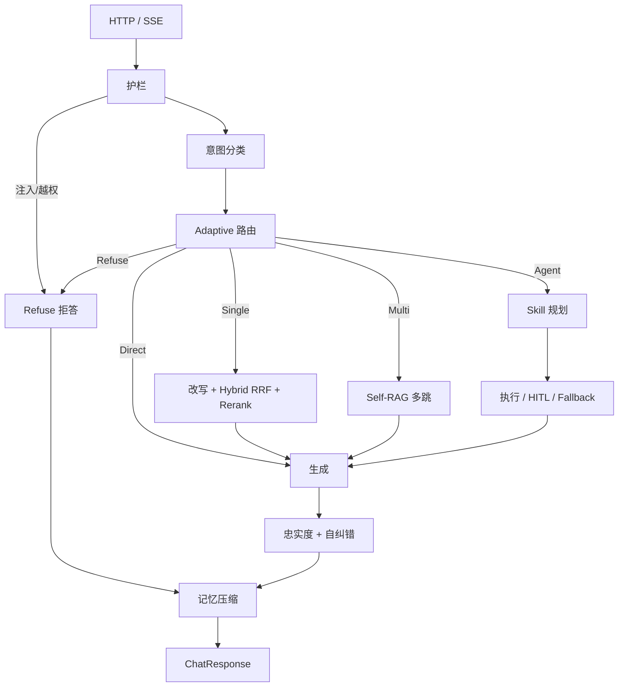

# 面试官：你这 RAG 是 Demo 还是能上线的？

> 对照仓库：Adaptive-RAG 电商客服。数字来自 `eval/MEASURED.md`（2026-08-22，DeepSeek `deepseek-chat` + Cross-Encoder）。没跑过的数字本文不写。想按八股模块逐条对代码，用 [16 · 八股对照](16-interview-bagu-map.md)。

## 一场面试带来的思考

「同学，简历上写了 Adaptive-RAG 多智能体客服。你先说说：所有问题都做一次向量检索吗？」

这是我被追问的第一句。很多人会下意识答「对，先 embed 再 top-k」。那正是面试官想听你**否定**的答案。

电商售后不是「百科问答」。用户会说「你好」、会要转人工、会问 `ORD10001` 有没有发货、会申请退款。如果问候也打一遍向量库，你浪费的不只是钱，还有延迟和幻觉空间。

接下来几乎是固定套餐：

- 向量和 BM25 分数能直接加吗？
- 召回有噪音怎么办？
- 模型说「帮用户退了」就真退吗？
- 超时重试会不会退两次？
- 你怎么证明不是 Demo？评测集在哪？P50/P95 多少？

如果项目只是 `similarity_search` + 拼 prompt，这些问题会把你问穿。下面按「玩具 vs 这个仓库」把差距摊开，代码都是仓库里的，不是为了发文新编的 Pipeline 框架。

---

## 什么是玩具 RAG？

玩具 RAG 大概长这样：

```python
class ToyRAG:
    def ask(self, question: str) -> str:
        docs = self.vectorstore.similarity_search(question)
        context = "\n".join(d.page_content for d in docs)
        return self.llm.chat(f"根据资料回答：\n{context}\n\n问题：{question}")
```

它能跑。但它默认了五件在客服场景里不成立的事：

1. **每个问题都该检索**（问候、注入、查订单都不该走同一条路）
2. **向量一路就够**（政策条款里充满「7 天」「ORD」「SKU」，关键词检索往往更稳）
3. **召回的都是证据**（没有忠实度检查，模型会把「可能」说成「已经退了」）
4. **LLM 输出可以直接执行副作用**（退款、取消没有人确认）
5. **没有数字**（不知道 Hit@1、幻觉率、P95，优化全凭感觉）

这就是「能跑的 Demo」和「能答辩 30 分钟」的差别。

---

## 工程化 RAG 在这个项目里长什么样？

对照那篇常见的「流水线文章」，我们没有再造一套 `PipelineStage` 基类，而是用 **LangGraph 条件边** 把阶段变成可测节点。阶段仍然在，只是编排方式不同。

| 环节 | 玩具 | 本仓库 |
|---|---|---|
| 要不要检索 | 永远检索 | Adaptive：Direct / Single / Multi / Agent / Refuse |
| 查询理解 | 原句去搜 | 护栏 → 意图 → 复杂度路由 → 改写 |
| 召回 | 单路向量 | BM25 + 向量，RRF 融 rank；一路允许失败 |
| 精排 | 无 | 本地 Cross-Encoder（bge-reranker-base；未加载权重时 CI 词面降级，不冒充 CE） |
| 多跳 | 无 | Self-RAG：检索 → JSON 打分 → 按 missing_aspect 再跳 |
| 工具 | 无 | 15 个 Schema 工具；写操作 HITL + 幂等 |
| 生成校验 | 无 | 忠实度检查 → LLM 自纠错 → 抽取式回退 |
| 长会话 | 无限拼历史 | 128k 预算，50% / 70% / 85% 三级压缩 |
| 评测 | 无 | 100 意图 / 65 检索 / 65 生成 / 16 E2E |

请求路径可以画成一条：

```text
HTTP → ChatService（限流、Session、UoW）
     → LangGraph
        护栏 → 意图 → 复杂度
          ├ Direct  生成
          ├ Refuse  拒答
          ├ Single  改写 → Hybrid → Rerank → 生成
          ├ Multi   Self-RAG 多跳 → 生成
          └ Agent   Skill 收缩目录 → 规划 → 执行（可读失败换工具）→ 生成
        → 忠实度 → 记忆压缩
```

节点名故意不和状态字段同名（`classify_intent` 而不是 `intent`），否则 LangGraph 会把更新写乱。图在进程启动时编译一次；SQLAlchemy session **每个请求新建**，用 contextvars 塞给工具，禁止把连接编进图里。

### 1.3 工程化完整框架（面试画板书用这张）

和原文「查询改写 → 多路召回 → 重排 → 生成」相比，客服多了 **Adaptive 五路** 和 **工具 HITL**。五层自上而下：

```text
┌─────────────────────────────────────────────────────────────────┐
│  接入层   FastAPI · SSE · 限流 · trace_id · UoW                 │
│           app/api  →  ChatService                               │
└─────────────────────────────────────────────────────────────────┘
                              │
                              ▼
┌─────────────────────────────────────────────────────────────────┐
│  编排层   LangGraph（进程启动时 compile 一次）                    │
│                                                                 │
│   护栏 ──► 意图 ──► Adaptive 路由                                │
│                         │                                       │
│            ┌────────────┼────────────┬──────────┐               │
│            ▼            ▼            ▼          ▼               │
│         Direct       Refuse       Single      Multi     Agent   │
│         直接生成      拒答      Hybrid检索   Self-RAG   规划+工具 │
│            │            │            │          │          │    │
│            └────────────┴────────────┴──────────┴──────────┘    │
│                              │                                  │
│                              ▼                                  │
│                    生成 ──► 忠实度/自纠错 ──► 记忆压缩            │
└─────────────────────────────────────────────────────────────────┘
          │                              │
          ▼                              ▼
┌──────────────────────┐    ┌─────────────────────────────────────┐
│ 检索子系统            │    │ 工具子系统                           │
│ 改写 · BM25 · 向量    │    │ 15 业务工具 · Skill 按需加载         │
│ RRF(k=60) · Cross-Encoder │    │ MCP Function Calling                │
│ Self-RAG ≤3 跳        │    │ HITL + 幂等 · 读失败 Fallback       │
│ app/retrieval/        │    │ app/tools · skills · mcp            │
└──────────────────────┘    └─────────────────────────────────────┘
                              │
                              ▼
┌─────────────────────────────────────────────────────────────────┐
│  基础设施  DeepSeek · Cross-Encoder · Postgres/SQLite · Redis · Qdrant │
│            Provider 隔离；缺 key 则 Fake / hash / 内存库         │
└─────────────────────────────────────────────────────────────────┘
```

对应 Graph 条件边（可直接贴进文章）：



流水线阶段对照原文那张表：

| 原文环节 | 本仓库落点 | 作用 |
|---|---|---|
| 意图分类 | `classify_intent` + 覆盖层 | 14 类；转人工压过退款 |
| 查询改写 | `QueryRewriter` | Single / 每一跳 Self-RAG |
| 多路召回 | BM25 + 向量，一路允许失败 | 无真 embedding 时 BM25 仍可用 |
| 结果融合 | RRF `k=60` | 融 rank 不融分数 |
| 重排序 | 本地 Cross-Encoder | 未加载权重不冒充 CE |
| Prompt / 生成 | `generate_node` JSON | citation_chunk_ids |
| 结果验证 | `check_faithfulness` | LLM 重写 → 抽取式回退 |
| （原文没有） | Agent + HITL | 订单/退款不能只靠检索 |
| （原文没有） | `compact_memory` | 128k 预算三级压缩 |

---

## 1. 架构：不是单点函数，是有界状态机

### 为什么拆节点？

单点 `ask()` 的问题是：检索失败、工具失败、幻觉、拒答全糊在一起，SSE 推不出进度，单测只能打整段。拆开之后：

- 哪个节点慢，Prometheus 分段延迟能看见
- 写工具可以在规划阶段就停住，等用户确认
- `MAX_AGENT_STEPS` / `MAX_TOOL_CALLS` 有硬上限

### 代码：按 strategy 走边

```python
# app/agents/graph.py
def _route_after_complexity(state: AgentState) -> str:
    strategy = state.get("strategy") or RetrievalStrategy.SINGLE
    return {
        RetrievalStrategy.DIRECT: "generate_answer",
        RetrievalStrategy.REFUSE: "refuse_answer",
        RetrievalStrategy.SINGLE: "retrieve_docs",
        RetrievalStrategy.MULTI: "retrieve_docs",  # 节点内再走 Self-RAG
        RetrievalStrategy.AGENT: "plan_tasks",
    }[strategy]
```

`SINGLE` 和 `MULTI` 共用 `retrieve_docs`，用 `state.strategy` 分支，避免复制一套边。

### 代码：Graph 编译一次，DB 每次新建

```python
# app/core/request_scope.py
_db_session: ContextVar[AsyncSession | None] = ContextVar("db_session", default=None)

def get_db_session() -> AsyncSession:
    session = _db_session.get()
    if session is None:
        raise RuntimeError("no request-scoped database session")
    return session
```

面试可以补一句：工具跑在节点闭包里，闭包是进程级的；如果把 `AsyncSession` 存进编译后的图，连接会串请求。

---

## 2. 检索：不是「embed 完 top-k」

### 2.1 先路由，再决定检不检索

Adaptive-RAG 论文三档（无检索 / 单跳 / 多跳），电商多两档：**Agent**（订单工具）和 **Refuse**（越权）。

LLM 分类失败必须还能跑。规则看意图、订单号、以及「同时 / 过了 / 但是」这类多跳线索：

```python
# app/retrieval/adaptive.py（规则兜底，缩写）
if intent.label == IntentLabel.OUT_OF_SCOPE:
    return ComplexityResult(strategy=RetrievalStrategy.REFUSE, ...)
if intent.label in {IntentLabel.GREETING, IntentLabel.CHITCHAT}:
    return ComplexityResult(strategy=RetrievalStrategy.DIRECT, ...)
if intent.label in {ORDER_INQUIRY, LOGISTICS, REFUND, ...} or 订单号:
    return ComplexityResult(strategy=RetrievalStrategy.AGENT, ...)
```

**主动说：** 有订单号时 Agent 优先于 Multi——先查系统，不要先搜政策。

### 2.2 为什么融 rank 不融分数？

BM25 和余弦不在同一量纲。写成 `0.5 * bm25 + 0.5 * cosine`，换 embedding 权重就失效。RRF 只看名次：

```python
# app/retrieval/fusion.py
# RRF(d) = Σ  1 / (k + rank_i(d)) ，k=60 是 Cormack 默认值，不是本项目调参结论
scores[chunk.chunk_id] = scores.get(chunk.chunk_id, 0.0) + 1.0 / (k + rank_position)
```

### 2.3 一路失败不能拖死另一路

```python
# app/retrieval/hybrid.py
try:
    lexical = self._bm25.search(query, top_k=top_k)
except Exception:
    lexical = []
try:
    dense = await self._vector.search(query, top_k=top_k)
except Exception:
    dense = []
if not lexical and not dense:
    raise RetrievalError("both lexical and dense retrievers failed")
fused = reciprocal_rank_fusion([lexical, dense], k=self._rrf_k)
```

**必须主动说：** 稠密路是 `bge-small-zh-v1.5`（不是 m3）。仅向量 P@1 **83.1%**、R@3 **94.6%**。BM25 对照 76.9% / 90% / 0.84。本 65 条上 RRF 与仅 small 相同；Cross-Encoder 把 P@1 / R@3 提到 **89.2% / 97.7%**。同日 hash 对照 Hit@1 只有 3.1%。

### 2.4 Self-RAG 不是特殊 token

多约束问题（定制 + 过了 7 天 + 质量）一跳经常只命中总则。每一跳检索后打 JSON 分：`sufficient` 为真就停，否则用 `missing_aspect` 改写再跳，上限 `MAX_RETRIEVAL_HOPS=3`。

```python
# app/retrieval/self_rag.py
class GradeResult(BaseModel):
    relevant: bool
    sufficient: bool
    missing_aspect: str = ""
```

结构化输出才能单测、才能失败时降级，而不是解析一堆特殊符号。

### 2.5 分块：稳定 ID 比「自适应花活」更值钱

玩具项目用 uuid4 当 chunk id，每次 ingest 引用全断。这里：

```python
# app/retrieval/chunking.py
MAX_CHUNK_CHARS, OVERLAP_CHARS = 500, 60

def stable_chunk_id(document_id: str, chunk_index: int) -> str:
    return f"{document_id}_{chunk_index:02d}"
```

生产用 Unstructured 按 Title/Table 等元素切，再映射稳定 `chunk_id`。缺依赖或 pytest 降级到 Markdown 标题切分。Qdrant point id 由 chunk_id 派生，重 ingest 覆盖同一点。知识库 39 篇 Markdown。

---

## 3. 智能体：检索解决不了「退这一单」

政策问答可以 RAG；「取消 ORD10003」必须打订单库，而且不能让模型直接写库。

### 3.1 意图：LLM + 覆盖层

生产路径：DeepSeek 出 JSON（`intent_v3`）→ 高置信覆盖层纠偏（转人工压过退款/投诉，「怎么算」走政策，「这件能不能退」走退换货）。LLM 挂了走关键词规则，再走同一覆盖层。

100 条离线集：规则 51% → 无覆盖 v1/v2 约 85%/86% → **v3+覆盖 100%**。

**主动说：** 准确率含覆盖层；覆盖是稳定中文客服短语，不是按 `i070` 写死金标。评测可以 `apply_overlay=False` 做消融。

### 3.2 Skill 按需加载

15 个工具全塞进 Planner，模型容易乱调 `cancel_order`。命中退货/物流/推荐 Skill 后，目录收缩成该 Skill 的工具 + `search_knowledge` + `escalate_to_human`。这是分解层 Fallback：LLM 规划失败就把 Skill JSON 落成步骤。

### 3.3 HITL + 幂等

```python
# app/tools/permissions.py
WRITE_RISKS = {ToolRisk.WRITE, ToolRisk.DESTRUCTIVE}

def assert_permitted(tool, *, confirmed: bool) -> None:
    if tool.risk in WRITE_RISKS and not confirmed:
        raise ToolPermissionError(...)
```

规划阶段生成 `pending_action`；客户端带 `confirm_action_id` 才执行。同一 idempotency key + 参数指纹返回首次结果，指纹不同则 `IDEMPOTENCY_CONFLICT`。

面试官问「超时重试会不会退两次」：答幂等键，不要答「我们重试次数很少」。

### 3.4 执行层 Fallback

读工具失败才换工具，例如 `get_order` → `search_knowledge`。**权限拒绝和写操作不走这张表**，防止未确认退款被「换一个工具」偷偷跑掉。

### 3.5 忠实度自纠错

生成后裁判 `supported`。失败先按证据 LLM 重写一轮，再抽取式回退。65 条（同模型裁判，偏乐观）：

| | Faithfulness | 幻觉率 | 关键词命中 |
|---|---|---|---|
| 无检索 | 76.9% | 23.1% | 35.4% |
| RAG | 98.5% | 1.5% | 84.6% |
| RAG + 自纠错 | 100% | 0% | 84.6% |

无检索 Faithfulness 落在 54%–88% 这档；幻觉相对下降 100%。关键词命中比同模型 Faithfulness 更独立，面试要并列表。

---

## 4. 评测：没有离线集就没有简历数字

完整报告：[14 · 测评报告](14-evaluation-report.md)。

玩具项目的致命伤是「我觉得效果还行」。这个仓库把数字钉在 runner 上：

```bash
python -m eval.runner --task retrieval          # CI，可无网
python -m eval.runner --task intent --llm
python -m eval.runner --task generation --llm
python -m eval.runner --task e2e --llm
```

文档级 P@k / R@k：chunk 的 `document_id` 去掉后缀 stem，再和 `relevant_doc_ids` 比。

```python
# eval/metrics.py
def precision_at_k(relevant, retrieved, k):
    top = retrieved[:k]
    return sum(item in relevant for item in top) / len(top)
```

E2E 16 条（含注入）：拒答/工具路径 100%；关键词 **9/11**；P50 **4.9s** / P95 **5.8s**。注入拒答大约 10ms——因为它根本不打 LLM。

pytest 清空真实 key、不下载本地模型（`tests/conftest.py`），49 passed。线上数字必须 `--llm`。

**不能写：** 没加载 Cross-Encoder 却写「CE 把 Precision 提到 xx」；没跑 generation 却写幻觉下降 62%。

---

## 5. 工程：超时、重试、观测、安全

| 维度 | 玩具 | 本仓库 |
|---|---|---|
| 超时 | 默认无限读 | connect 3s / read 30s / write 10s / pool 5s |
| 重试 | 无或遇错就重试 | full jitter；401/403/422 不重试 |
| 限流 | 无 | 按 `user_id`；Redis 挂 fail-open |
| 鉴权 | 无 | admin 生产必须 token；比对 `hmac.compare_digest` |
| 注入 | 无 | 正则拦截 + 检索内容当 untrusted data |
| 日志 | print | JSON + `trace_id`；密钥 `SecretStr` |
| 指标 | 无 | `/metrics`：策略、分段延迟、工具 fallback、幻觉计数 |
| 流式 | 无 | SSE：`node` + DeepSeek `token` |
| 配置 | 硬编码 | pydantic-settings；Fake LLM / hash 向量 / 内存库可降级 |

```python
# app/core/retry.py
RETRYABLE = {408, 429, 500, 502, 503, 504}

def _full_jitter_delay(attempt, base, cap):
    ceiling = min(cap, base * (2 ** attempt))
    return random.uniform(0.0, ceiling)
```

401 若重试，坏密钥会被放大成一串无效计费。指数退避若无 jitter，所有副本同一时刻醒来。

业务「证据不足」是 **HTTP 200 + 文案**；DeepSeek 超时才是 **503 `LLM_TIMEOUT`**。这两种不要混。

---

## 面试可以怎么答（对照本文）

面试官真正想听的不是框架名字，而是你有没有把失败路径设计进去。

**问：为什么不是所有 query 都向量检索？**  
答：Adaptive 路由。问候 Direct；越权 Refuse；政策 Single/Multi；订单 Agent。论文三档不够电商用。

**问：Hybrid 怎么融？**  
答：RRF 融 rank，k=60 是文献默认。BM25 与余弦量纲不同。本轮仅 `bge-small` P@1 83.1%；RRF 与仅 small 相同；对外报 Hybrid+CE 89.2% / 97.7% / 0.94。hash 对照 Hit@1 3.1%。

**问：幻觉怎么压？**  
答：生成后忠实度检查，失败先 LLM 按证据重写，再抽取式回退。65 条上无检索幻觉 20% → RAG 3.1% → 自纠错 0%。同模型裁判偏乐观，所以同时报关键词命中 36.9% → 95.4%。

**问：退款会不会误执行、会不会退两次？**  
答：write/destructive 必须 `confirm_action_id`。幂等键 + 参数指纹。读失败才 Fallback，写失败不换写工具。

**问：怎么证明不是 Demo？**  
答：离线集 + `eval.runner` + pytest。简历数字以 MEASURED 为准。P50 4.9s / P95 5.8s。意图 100 条含覆盖层 100%。Hybrid+CE P@1 89.2%。

**问：还有什么没做？**  
答：没加载 Cross-Encoder 就不报 CE 数字；稠密路是 small 不是 m3；本集 RRF 没有超过仅 small；订单是种子数据不是承运商 API；token 预算是启发式不是官方 tokenizer。

如果你只能说「我用 LangChain 接了个向量库」，那仍是玩具。如果你能把上面几段连起来，并且数字对得上仓库，这才是「可工程化落地」在这个项目里的含义。

---

## 写在最后

Demo 和产品的差别，不在多套一层框架，而在：

- 你知不知道**什么时候不该检索**
- 你知不知道**两路分数不能加**
- 你知不知道**模型想退 ≠ 用户同意退**
- 你手里有没有一份**改 Prompt 必须重跑的评测集**

仓库手册按「要点 → 代码摘要 → 为什么」写在 `docs/`。本文是同一套实现的面试稿，数字以 [`eval/MEASURED.md`](../eval/MEASURED.md) 为准。
